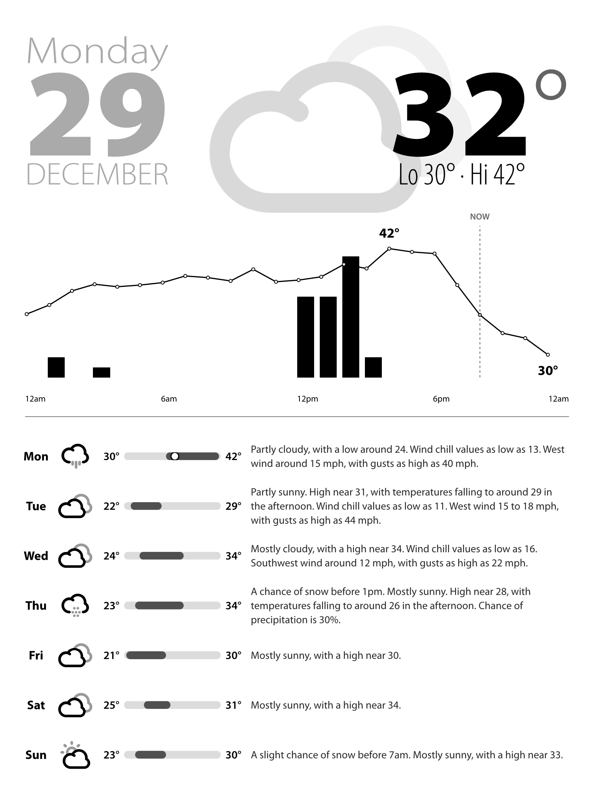

# Kindle Weather Dashboard

A weather dashboard PNG generator optimized for Kindle e-ink displays.



## Goal

Generate a clean, high-contrast weather dashboard image that can be displayed on a rooted Kindle. The output is a 758x1024 PNG designed for e-ink.

Run this on a server (cron job, etc.), transfer the PNG to your Kindle, and display it as a screensaver or with a custom launcher.

## Requirements

- [Typst](https://typst.app/) - document compiler
- `curl` - for API requests
- A rooted Kindle (for display)

## Setup

1. Clone this repo
2. Edit `generate.sh` to set your location:
   ```bash
   LAT="41.31"      # Your latitude
   LON="-72.92"     # Your longitude
   TIMEZONE="America/New_York"
   ```

## Usage

```bash
./generate.sh
```

Outputs `dashboard.png`.

## API

Uses [Open-Meteo](https://open-meteo.com/) for weather data. Free, no API key required.

## Resources

- **Icons**: [weather-iconic](https://github.com/konradmichalik/weather-iconic) by Konrad Michalik
- **Weather Data**: [Open-Meteo](https://open-meteo.com/)
- **Rendering**: [Typst](https://typst.app/)

## Kindle Setup

For instructions on rooting your Kindle and displaying custom images, see [kindlemodding.org](https://kindlemodding.org/).

## License

[Unlicense](https://unlicense.org/) - Public domain. Do whatever you want.
